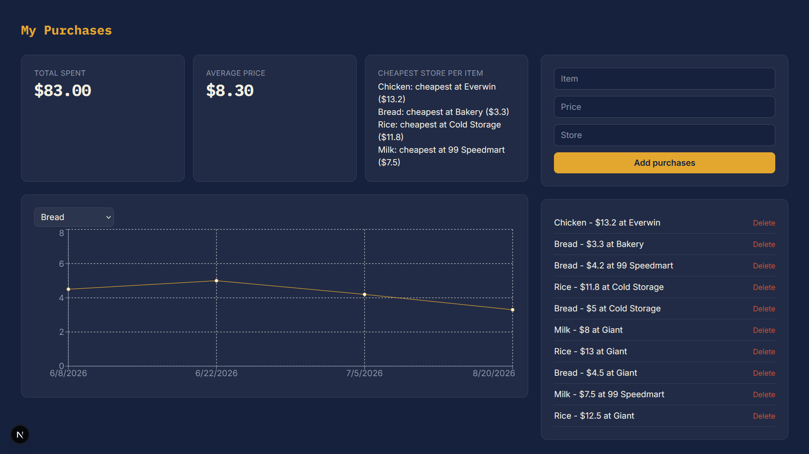

# Price Tracker

A personal shopping tracker to log purchases and answer a simple question: is this cheap or expensive, and where should I actually be buying it?



## Features

- Log purchases (item, price, store) with instant persistence
- Live dashboard: total spend, average price, cheapest store per item
- Price trend chart per item over time
- Delete purchases

## Tech stack

- [Next.js](https://nextjs.org/) (App Router) + React
- [Supabase](https://supabase.com/) (PostgreSQL) for the database
- [Tailwind CSS](https://tailwindcss.com/) for styling
- [Recharts](https://recharts.org/) for the price trend chart

## Running locally

1. Clone the repo
```bash
   git clone https://github.com/hamdan-mu/price-tracker.git
   cd price-tracker
```

2. Install dependencies
```bash
   npm install
```

3. Set up Supabase
   - Create a project at [supabase.com](https://supabase.com)
   - Create a `purchases` table with columns: `item` (text), `price` (numeric), `store` (text)
   - Enable RLS and add a policy allowing `anon` access (see `/docs` if you add setup notes later, or ask if you're setting this up yourself)

4. Add environment variables — create `.env.local` in the project root:
```
    NEXT_PUBLIC_SUPABASE_URL=your-project-url
    NEXT_PUBLIC_SUPABASE_ANON_KEY=your-anon-key
```

5. Run the dev server
```bash
   npm run dev
```
   Open [http://localhost:3000](http://localhost:3000)

## Why I built this

I struggled to judge whether a price was actually good or bad. This tracks purchases over time so I can see real trends instead of guessing.

## Status

Actively in development. Planned: editing purchases, category-based spend breakdown, deployment.